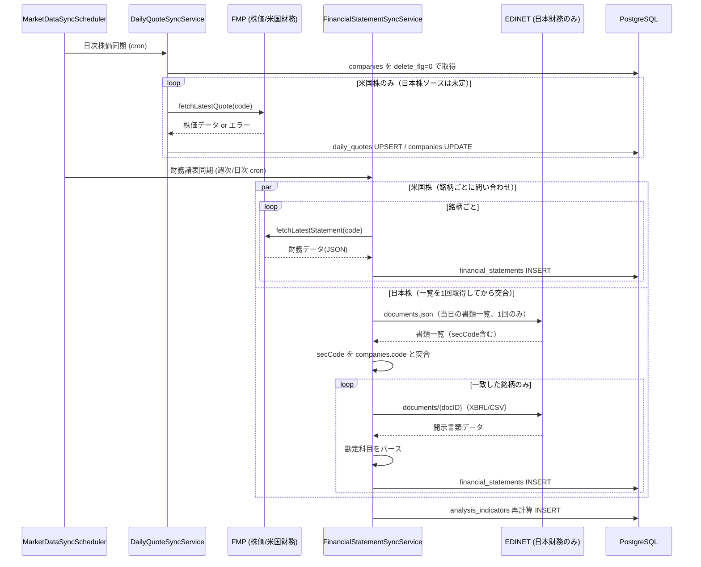

# 銘柄データ定期取得バッチ 詳細設計（ドラフト）

このドキュメントは、`companies` テーブルに登録済みの銘柄について、現在株価・財務指標を外部 API から
定期的に取得し DB を更新するバッチ処理の設計案である。**現時点ではコード未着手。設計レビュー用のドラフト。**

---

## 1. 目的

- `companies.current_price` / `outstanding_shares` / `market_cap` を最新の株価情報で自動更新する
- `daily_quotes`（日次株価）を毎営業日積み上げる
- `financial_statements`（四半期決算）を決算発表のたびに取り込む
- 上記により `StockDetailServiceImpl.getComprehensiveAnalysis()` が返す分析結果を、手動更新なしで
  常に最新の状態に保つ

## 2. スコープ

### 対象データ（今回）

| データ | 格納先テーブル | 更新頻度 |
|---|---|---|
| 現在株価・出来高・時価総額 | `companies`（current_price 等）, `daily_quotes` | 日次（営業日） |
| 財務諸表（売上・利益・BS/CF 項目） | `financial_statements` | 四半期（決算発表都度） |
| 分析指標（ROE・PER 等の派生値） | `analysis_indicators` | 財務諸表更新に連動して再計算 |

### スコープ外（今回は対象外、将来検討）

- ニュース・適時開示・アナリスト予想の取得
- 配当カレンダー、株式分割イベントの自動検知
- リアルタイム（分足・秒足）株価
- `company_valuation_parameter_defaults`（DCF 前提パラメータ）の自動更新 — こちらは既存の
  評価モデル機能側の管轄とし本バッチでは触らない

---

## 3. 全体アーキテクチャ

### 3.1 起動方式の比較

| 方式 | 概要 | 長所 | 短所 |
|---|---|---|---|
| **Spring `@Scheduled`（推奨・初期案）** | アプリ常駐プロセス内で cron 式実行 | 追加インフラ不要、既存 Spring 資産をそのまま再利用できる、実装がシンプル | アプリを止めると実行されない。Windows タスクスケジューラ相当の外形監視が別途必要 |
| 外部 cron / Windows タスクスケジューラ + `CommandLineRunner` バッチモード | `--batch.mode=marketdata` のような引数でバッチ専用に起動し、外部スケジューラが定期実行 | アプリ本体と実行ライフサイクルを分離できる、失敗時の再実行が cron 側で完結 | 別プロセス起動のオーバーヘッド、Windows/本番環境でスケジューラの二重管理が必要 |
| Spring Batch | Step/Chunk/JobRepository によるジョブ管理フレームワーク | 再実行・スキップ・トランザクション制御が本格的 | 現状の銘柄数・処理内容に対しては過剰。学習コストと依存追加が大きい |

**推奨: まずは `@Scheduled` で実装し、運用が安定してから必要に応じて Spring Batch へ移行する。**
現状 `mvn spring-boot:run` で常駐させる運用（`docs` の `run-app` スキル前提）と整合する。

### 3.2 パッケージ構成（既存の機能単位ルールに準拠）

`dao` / `entity` は既存ルール通り `web.dao` / `web.entity` 直下に残し、新規テーブルが必要な場合のみ追加する。
バッチ固有のロジックは新規 `web.batch` 配下にまとめる（画面系の `web.stock.<feature>` とは独立させる）。

```
src/main/java/org/example/web/batch/
├── marketdata/
│   ├── scheduler/
│   │   └── MarketDataSyncScheduler.java        … @Scheduled エントリポイント（cron 定義）
│   ├── service/
│   │   ├── DailyQuoteSyncService.java / Impl    … 日次株価同期
│   │   ├── FinancialStatementSyncService.java / Impl … 四半期財務データ同期
│   │   └── AnalysisIndicatorRecalcService.java / Impl … 財務データ更新後の指標再計算
│   ├── client/
│   │   ├── StockPriceProvider.java（interface）  … 株価取得の抽象化
│   │   │   ├── YahooFinanceStockPriceProviderImpl.java（日本株用、yfinance 相当）
│   │   │   └── FmpStockPriceProviderImpl.java（米国株用）
│   │   ├── FinancialDataProvider.java（interface） … 財務データ取得の抽象化
│   │   │   ├── EdinetFinancialDataProviderImpl.java（日本株用、EDINET）
│   │   │   └── FmpFinancialDataProviderImpl.java（米国株用）
│   │   └── dto/                                  … 各 API のレスポンス（JSON / XBRL）にマッピングする DTO
│   └── config/
│       ├── MarketDataApiProperties.java          … `@ConfigurationProperties` で API キー等を束ねる
│       └── RestClientConfig.java                 … タイムアウト・リトライ込みの HTTP クライアント Bean
```

- `StockPriceProvider` / `FinancialDataProvider` はインタフェースとして分離し、銘柄の `country_id` /
  `currency_id` から実装を切り替える（プロバイダ振り分けは 4.1 参照）。これにより将来プロバイダを
  差し替える・複数プロバイダを併用する場合も呼び出し側（Service）に影響を与えない。
- 外部 API 呼び出し部分をインタフェースの背後に隠すことで、Java ユニットテストが存在しない現状の
  プロジェクトに対して、この機能から `StockPriceProvider` のモック実装を使ったテストを導入しやすくする。
- **`YahooFinanceStockPriceProviderImpl` の実装方針（前提の明記）**: `yfinance` は Python 専用ライブラリで
  あり、Java/Maven 構成の本プロジェクトに Python ランタイムを追加するのは既存スタックと整合しないため、
  `yfinance` が内部で叩いているのと同じ Yahoo Finance の非公式エンドポイント
  （`query1.finance.yahoo.com/v8/finance/chart/{symbol}` 等）を Java の HTTP クライアントから直接呼ぶ
  実装とする（＝「yfinance と同じデータソースを Java で再現する」方針）。Python サブプロセスを呼び出す
  構成にしたい場合は別途相談が必要 — 5.4 に前提として明記する。

---

## 4. 処理フロー詳細

### 4.1 対象銘柄の抽出とプロバイダ振り分け

1. `companies` から `delete_flg = 0` の銘柄を全件取得
2. `country_id` → `countries.code`（例: `JP` / `US`）を引き、日本株/米国株を判定
3. 判定結果に応じて `StockPriceProvider` / `FinancialDataProvider` の実装（Bean）を選択
   - 判定ロジックは `Map<String, StockPriceProvider>`（Spring の Bean 名 or `@Qualifier`）で
     国コード → 実装をルックアップする形にし、`if/else` の分岐を増やさない
4. 銘柄コードのマッピング
   - 米国株は `companies.code`（例 `AAPL`）がそのまま FMP のシンボルとして使える
   - 日本株の株価（Yahoo Finance）は `companies.code` の 4 桁証券コード（例 `4452`）に `.T`
     サフィックスを付与した `4452.T` が Yahoo Finance 側のシンボルになる
     （`YahooFinanceStockPriceProviderImpl` 内でコード変換する）
   - 日本株の財務（EDINET）は `companies.code` の 4 桁証券コード（例 `4452`）と EDINET 側の `secCode`
     （5 桁・末尾 0 埋め、例 `44520`）の対応が必要。EDINET 書類一覧 API のレスポンスに `secCode`
     が含まれるため、末尾の `0` を除去して 4 桁化すれば `companies.code` と突合できる
     （EDINET コード自体は証券コードと別体系だが、今回は `secCode` フィールドのみで足りる想定）
   - ※ 実際の登録データ（`code` カラム）が本当にこの形式で統一されているかは、実装時に
     `companies` の実データで確認する

### 4.2 日次株価同期（`DailyQuoteSyncService`)

> **注意**: EDINET は有価証券報告書等の開示書類 API であり、株価・出来高・時価総額といった
> 相場データは一切提供していない。日本株の `daily_quotes` / `companies.current_price` は
> Yahoo Finance（yfinance 相当、5.3 参照）から取得する。

- **実行タイミング（案）**: 市場ごとに分離
  - 日本株ジョブ（Yahoo Finance）: 平日 JST 16:00（東証大引け後）
  - 米国株ジョブ（FMP）: 平日 JST 06:30（米国市場引け後、サマータイム考慮が必要）
- **処理内容**（銘柄ごとに実施、1 件の失敗で全体を止めない）
  1. `StockPriceProvider.fetchLatestQuote(code)` で当日の始値・高値・安値・終値・出来高・時価総額を取得
  2. `daily_quotes` に対して `(company_id, date)` で UPSERT
  3. `companies.current_price` / `market_cap` / `outstanding_shares` を最新値で更新
  4. 取得失敗（銘柄が API 側に存在しない、レート制限等）はログに記録し次の銘柄へ継続
- **冪等性**: 同日に複数回実行されても `(company_id, date)` の UNIQUE 制約＋ UPSERT で安全に再実行できる

### 4.3 財務諸表同期（`FinancialStatementSyncService`)

米国株（FMP）と日本株（EDINET）で取得モデルが根本的に異なるため、処理フローを分けて説明する。

#### 4.3.1 米国株（FMP） — 銘柄ごとに問い合わせる方式

- **実行タイミング（案）**: 週次（例: 毎週月曜 JST 03:00、市場が動いていない時間帯）
  - 決算発表は不定期なため、日次で全銘柄をポーリングするのは API 呼び出し数の観点で非効率。
    週次で「まだ取り込んでいない最新の四半期データがあるか」を確認する方式にする
- **処理内容**
  1. 銘柄ごとに `financial_statements` の最新 `(fiscal_year, fiscal_quarter)` を取得
  2. `FmpFinancialDataProviderImpl.fetchLatestStatement(code)` で API 側の最新四半期データを取得
  3. API 側の四半期が DB より新しければ `financial_statements` に INSERT
  4. INSERT 成功した銘柄について `AnalysisIndicatorRecalcService` を呼び出し `analysis_indicators`
     を再計算・INSERT

#### 4.3.2 日本株（EDINET） — 「その日の提出書類一覧」を先に取得してから自社銘柄と突合する方式

EDINET には「銘柄コードを指定して財務データを取得する」エンドポイントは存在しない。
提供されるのは「指定日に提出された開示書類の一覧」であり、日次でこの一覧を舐めて
自社の登録銘柄（`secCode`）と一致する書類を探しに行く、という逆方向のモデルになる。
そのため FMP のように「銘柄ループの中で 1 件ずつ API を呼ぶ」実装にはせず、以下の順序にする。

- **実行タイミング（案）**: 日次（例: 毎日 JST 20:00、EDINET は書類提出当日中に一覧へ反映される）
- **処理内容**
  1. `documents.json`（書類一覧 API, `type=2`）を **その日 1 回だけ** 呼び出し、提出書類一覧を取得する
     （銘柄ごとに呼ぶと同じ一覧を何度も取得することになり無駄なため、バッチ実行単位で 1 回のみ取得し
     内部キャッシュとして保持する）
  2. 一覧の中から `docTypeCode` が「有価証券報告書（120）」「半期報告書（旧四半期報告書、160 系）」
     のものだけに絞り込む
  3. 絞り込んだ書類の `secCode`（5 桁・末尾 0）末尾の `0` を除去し、`companies.code` と突合する
  4. 一致した銘柄について `documents/{docID}`（`type=5`, CSV 形式の XBRL 代替データ）をダウンロードし、
     売上高・営業利益・純利益・EPS・BPS 等の勘定科目要素をパースして `financial_statements` に INSERT
  5. INSERT 成功した銘柄について `AnalysisIndicatorRecalcService` を呼び出し `analysis_indicators`
     を再計算・INSERT

- **重要な制約（要認識合わせ）**: 2024 年 4 月以後開始事業年度から、四半期報告書（第 1・第 3 四半期相当）
  制度が廃止され、開示は決算短信（東証 TDnet 経由、EDINET 対象外）に一本化されている。
  そのため EDINET から日本株の `financial_statements` へ機械的に取り込めるのは実質
  **有価証券報告書（年次、`fiscal_quarter='Q4'` 相当）と半期報告書（`fiscal_quarter='Q2'` 相当）の
  年 2 回程度**にとどまる。既存スキーマは `fiscal_quarter` に `'Q1'`〜`'Q4'` の 4 値を想定しているが、
  日本株については当面 `Q1` / `Q3` が欠測のままになる想定でよいか、11 章で確認したい。
- **実装上のリスク**: EDINET の書類本体は XBRL（財務諸表の標準化 XML）で、CSV 代替形式（`type=5`）を
  使っても勘定科目は EDINET のタクソノミ要素名（例 `jppfs_cor:NetSales`）に基づく解析が必要になる。
  FMP のような整形済み JSON を返す API と比べてパース実装の難易度・工数が高い点は事前に認識しておく。

### 4.3.3 共通: 指標再計算

- **注意点（要確認事項）**: `analysis_indicators`（ROE・PER・自己資本比率等）を算出するロジックが
  現状サーバ側のどこにも存在しない可能性がある（フロント `pv_calculator.js` は理論株価計算専用で別物）。
  この設計の一部として算出ロジックをサーバ側に新規実装する必要がある想定で計画する。

### 4.4 バッチ全体のシーケンス図



---

## 5. 外部 API 選定（確定）

「無料 API を必須」という制約のもと、以下で確定する。

| 対象 | API | 用途 | 料金 |
|---|---|---|---|
| 日本株 | **EDINET API v2**（金融庁） | 財務諸表（有価証券報告書・半期報告書）のみ | 無料（利用申請＋API キー発行が必要、リクエスト自体は無料） |
| 日本株 | **Yahoo Finance（yfinance 相当）** | 株価・出来高・時価総額 | 無料（非公式、API キー不要） |
| 米国株 | **Financial Modeling Prep (FMP)** | 株価 ＋ 財務諸表 | 無料枠あり（Starter プラン、1 日あたりのリクエスト数に上限あり） |

### 5.1 EDINET API v2（日本株・財務諸表）

- 提供元: 金融庁（EDINET＝ Electronic Disclosure for Investors' NETwork）
- 無料。利用には EDINET サイトでの利用者登録＋ API キー（サブスクリプションキー）発行が必要
- 提供データ: 有価証券報告書・半期報告書・臨時報告書などの**開示書類そのもの**（XBRL/PDF/CSV）
- **株価・出来高・時価総額などの相場データは一切含まれない**（4.2 に記載の通り、日本株の
  `daily_quotes` 更新には別ソースが必要 — 11 章の未決事項）
- 主要エンドポイント
  - `GET /api/v2/documents.json?date=YYYY-MM-DD&type=2` … 指定日に提出された書類の一覧（`secCode`,
    `docTypeCode`, `docID` 等を含む）
  - `GET /api/v2/documents/{docID}?type=5` … 書類データ本体（CSV 形式の XBRL 代替データ）
- 財務諸表は XBRL ベースのため、勘定科目（売上高・営業利益等）をタクソノミ要素名から抽出する
  パース処理を自前で実装する必要がある（4.3.2 参照）
- 四半期報告書制度の廃止（2024 年 4 月以後開始事業年度〜）により、日本株の財務更新頻度は
  実質「年次＋半期」の年 2 回程度になる（4.3.2 参照）

### 5.2 Financial Modeling Prep（米国株・株価＋財務諸表）

- 無料登録で API キーを取得（Starter プラン、1 日あたりのリクエスト数に上限あり。実装時に
  最新の無料枠上限をドキュメントで確認する）
- 株価取得: `GET /api/v3/quote/{symbol}` で現在値・出来高・時価総額・発行済株式数などを取得
- 財務諸表取得: `GET /api/v3/income-statement/{symbol}`、`balance-sheet-statement`、
  `cash-flow-statement` の四半期版（`?period=quarter`）で損益計算書・貸借対照表・キャッシュフロー
  計算書を取得
- 財務比率（ROE・PER 等）を計算済みで返すエンドポイント（`ratios`）もあり、`analysis_indicators`
  の一部はここから直接転記できる可能性がある（要検証）
- レスポンスが JSON で整形済みのため、EDINET と比べて実装負荷は大幅に低い

### 5.3 Yahoo Finance（日本株・株価、yfinance 相当）（確定）

- `yfinance` は Python 専用ライブラリのため、そのまま Java プロジェクトに組み込むことはできない。
  そのため `yfinance` が内部で利用しているのと同じ Yahoo Finance の**非公式** REST エンドポイント
  （例: `https://query1.finance.yahoo.com/v8/finance/chart/{symbol}`）を Java の HTTP クライアント
  から直接呼び出す実装とする（3.2 の前提を参照）
- シンボル形式: 日本株は証券コードに `.T` を付与（例 `4452.T`）
- 取得可能データ: 直近の終値・始値・高値・安値・出来高（`chart` API のレスポンスに含まれる範囲）。
  時価総額・発行済株式数は別エンドポイント（`quoteSummary` 系）が必要になる場合がある
- **リスク・注意点（要認識合わせ）**
  - **非公式 API のため Yahoo 側の利用規約上グレー**。個人利用・検証目的の範囲を超えないことを
    前提とする（商用利用や大量アクセスは規約違反リスクがある）
  - エンドポイント仕様が予告なく変更・停止される可能性があり、SLA が存在しない
  - 2023 年頃から Yahoo 側がボット対策として `crumb`（トークン）+ Cookie の取得を要求するように
    なっており、単純な GET だけでは 401/429 が返るケースがある。実装時に Cookie 取得 →
    `crumb` 取得 → 本リクエスト、という 2 段階のハンドシェイクが必要になる可能性が高い
  - レート制限は非公開のため、リクエスト間隔を保守的に空ける（4.2 のジョブ内で銘柄間にウェイトを
    入れる）運用でカバーする

### 5.4 検討したが不採用にした選択肢（参考）

| API | 不採用理由 |
|---|---|
| J-Quants API（日本株、株価） | 無料プランはデータに遅延があるため、遅延の少ない Yahoo Finance を採用 |
| Alpha Vantage / Finnhub（米国株） | FMP に確定したため不使用 |
| EOD Historical Data 等の統合プロバイダ | 有料が前提のため「無料 API 必須」の制約と合わない |

---

## 6. 認証情報・設定管理

- 現状 `application.properties` に DB パスワードが平文で入っている（CLAUDE.md記載の既知課題）。
  今回新たに追加する API キーで同じ問題を繰り返さないよう、最初から環境変数化する
  - `MarketDataApiProperties`（`@ConfigurationProperties(prefix = "marketdata.api")`）で
    `edinet.api-key` / `fmp.api-key` を束ね、値は `${EDINET_API_KEY}` / `${FMP_API_KEY}` のように
    環境変数経由で注入する
  - ローカル開発用に `application-local.properties`（`.gitignore` 対象）を新設し、Git 管理対象の
    `application.properties` にはプレースホルダのみ残す案も検討（この機に DB パスワードも同じ方式へ移行できる）

---

## 7. エラーハンドリング・リトライ・レート制限

- **銘柄単位で例外を握りつぶす**: 1 銘柄の取得失敗（404・タイムアウト等）でバッチ全体を止めない。
  失敗した銘柄コードと理由をログ（将来的には後述の実行ログテーブル）に記録し、次回バッチで再取得を試みる
- **レート制限対応**: 無料プランは 1 分あたりのリクエスト数に上限があることが多いため、
  銘柄ループ内に一定間隔のウェイトを入れる、または `Bucket4j` 等のレートリミッタ導入を検討
- **429（Too Many Requests）時**: 指数バックオフでリトライ（最大 N 回）。上限超過時はその回のバッチを
  打ち切り、次回スケジュールに委ねる
- **通知**: 失敗率が閾値を超えた場合の通知先（メール／Slack 等）は現状未定 — 必要か含めて確認したい

---

## 8. 新規 DB テーブル案

### 8.1 `batch_execution_logs`（バッチ実行履歴）

```sql
CREATE TABLE batch_execution_logs (
  id             serial PRIMARY KEY,
  batch_type     varchar(50)  NOT NULL,   -- 'DAILY_QUOTE' / 'FINANCIAL_STATEMENT'
  started_at     timestamp    NOT NULL,
  finished_at    timestamp,
  target_count   integer,
  success_count  integer,
  failure_count  integer,
  status         varchar(20)  NOT NULL,   -- 'RUNNING' / 'SUCCESS' / 'FAILED'
  error_summary  text
);
```

### 8.2 `market_data_fetch_errors`（銘柄単位の取得失敗履歴、任意）

```sql
CREATE TABLE market_data_fetch_errors (
  id                serial PRIMARY KEY,
  batch_execution_id integer NOT NULL REFERENCES batch_execution_logs(id),
  company_id        integer NOT NULL REFERENCES companies(id),
  error_message     text,
  occurred_at       timestamp NOT NULL DEFAULT now()
);
```

既存の `db/migration/V00x__*.sql` 命名規則（Flyway 未導入・手動適用）に従い、
`V003__batch_execution_logs.sql` のような形で追加する想定。

---

## 9. 段階的実装ステップ（案）

1. **Step 1**: `StockPriceProvider` / `FinancialDataProvider` インタフェースを定義し、1 プロバイダ・
   1 銘柄で手動起動できる状態にする（`@Scheduled` はまだ付けない、`CommandLineRunner` 等で動作確認）
2. **Step 2**: 対象銘柄を全件ループする `DailyQuoteSyncService` を実装し、`daily_quotes` / `companies`
   への UPSERT を実データで確認する
3. **Step 3**: `MarketDataSyncScheduler` に `@Scheduled(cron = ...)` を付与し自動実行化する
4. **Step 4**: `FinancialStatementSyncService` と `AnalysisIndicatorRecalcService` を実装する
5. **Step 5**: エラーハンドリング・実行ログテーブル・レート制限対応を組み込む
6. **Step 6**: 米国株側のプロバイダを追加し、日米両対応にする

各ステップごとに `mvn clean compile` と実データでの動作確認を行う（既存プロジェクトの検証方針に準拠）。

---

## 10. テスト方針

- `src/test/java` が現状存在しないプロジェクトのため、本バッチ機能を機に Java ユニットテストを導入する
- `StockPriceProvider` / `FinancialDataProvider` をインタフェース化してあるため、外部 API 呼び出し部分は
  モック実装（または WireMock 等によるスタブサーバ）に差し替えてテスト可能にする
- 重点的にテストすべき箇所
  - UPSERT ロジック（同日再実行時に重複行が増えないこと）
  - 四半期の新旧比較ロジック（既に取り込み済みの四半期を再取得しないこと）
  - 1 銘柄の失敗が他銘柄の処理を止めないこと

---

## 11. 未決事項（ユーザー確認が必要な項目）

~~外部 API の選定~~ → **確定**: 日本株財務 = EDINET、日本株株価 = Yahoo Finance（yfinance 相当）、
米国株株価・財務 = FMP（5 章参照）

1. **Yahoo Finance を Python の `yfinance` ライブラリそのもので使うか、Java から同等のエンドポイントを
   直接叩く実装にするか**。5.3 の前提では後者（Java 実装）としているが、Python サブプロセス /
   マイクロサービス経由で本物の `yfinance` を使いたい場合は構成が大きく変わるため確認したい
2. 日本株の財務データが年 2 回（有価証券報告書＋半期報告書）しか更新されない点を許容するか
   （4.3.2 参照。米国株は FMP で四半期ごとに更新される想定とのギャップがある）
3. バッチの実行方式（`@Scheduled` 常駐か、外部スケジューラ起動か）
4. 実行頻度・時間帯（日次株価・EDINET 日次ポーリング・FMP 週次で問題ないか）
5. 失敗時の通知要否（メール／Slack 等）
6. `analysis_indicators` の算出ロジックをどこに実装するか（本バッチ内 or 既存の評価モデル機能側）
7. EDINET の XBRL/CSV パースで実際にどの勘定科目タクソノミ要素を対象にするか（実装時に
   サンプル書類で確認が必要）
