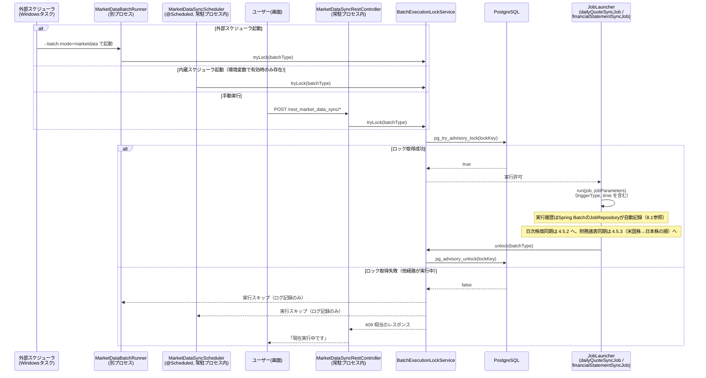
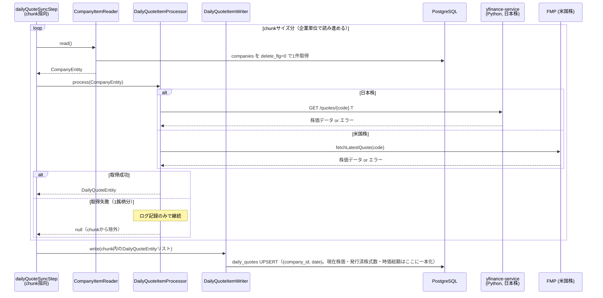
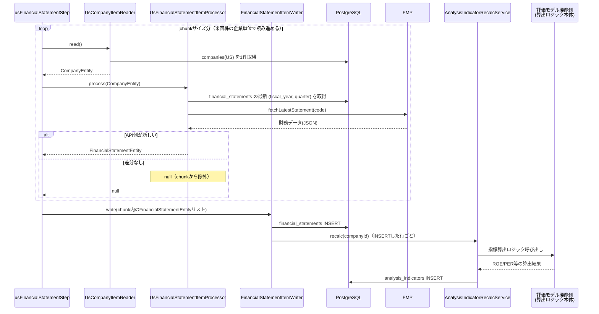
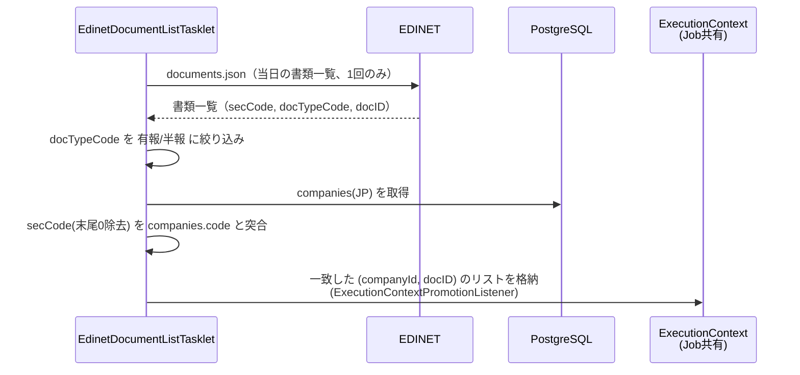
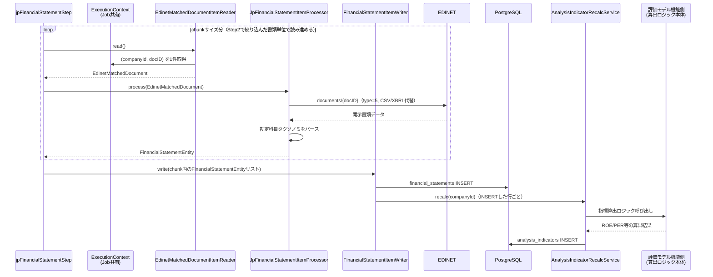

# 銘柄データ定期取得バッチ 詳細設計（ドラフト）

このドキュメントは、`companies` テーブルに登録済みの銘柄について、現在株価・財務指標を外部 API から
定期的に取得し DB を更新するバッチ処理の設計案である。**現時点ではコード未着手。設計レビュー用のドラフト。**

---

## 1. 目的

- `daily_quotes`（日次株価。現在株価・発行済株式数を含む）を毎営業日積み上げる
- `financial_statements`（四半期決算）を決算発表のたびに取り込む
- 上記により `StockDetailServiceImpl.getComprehensiveAnalysis()` が返す分析結果を、手動更新なしで
  常に最新の状態に保つ

## 2. スコープ

### 対象データ（今回）

| データ                             | 格納先テーブル                                               | 更新頻度                                             |
| ---------------------------------- | ------------------------------------------------------------ | ---------------------------------------------------- |
| 現在株価・出来高・発行済株式数     | `daily_quotes`（close_price・shares_outstanding 等に一本化） | 日次（営業日）                                       |
| 財務諸表（売上・利益・BS/CF 項目） | `financial_statements`                                       | 四半期（決算発表都度、日本株は環境変数で頻度調整可） |
| 分析指標（ROE・PER 等の派生値）    | `analysis_indicators`                                        | 財務諸表更新に連動して再計算                         |

### スコープ外（今回は対象外、将来検討）

- ニュース・適時開示・アナリスト予想の取得
- 配当カレンダー、株式分割イベントの自動検知
- リアルタイム（分足・秒足）株価
- `company_valuation_parameter_defaults`（DCF 前提パラメータ）の自動更新 — こちらは既存の
  評価モデル機能側の管轄とし本バッチでは触らない
- 失敗時のメール／Slack 等への通知（11 章 回答 5。将来、通知処理自体を別機能として実装する予定であり、
  本バッチの設計では扱わない）

---

## 3. 全体アーキテクチャ

### 3.1 起動方式と処理エンジン

「起動方式」（いつ・どのプロセスから呼び出すか）と「処理エンジン」（呼び出された後の処理をどう実装するか）は
別軸の決定であり、分けて整理する。

#### 起動方式の比較

| 方式                                                                                      | 概要                                                                                   | 長所                                                                       | 短所                                                                             |
| ----------------------------------------------------------------------------------------- | -------------------------------------------------------------------------------------- | -------------------------------------------------------------------------- | -------------------------------------------------------------------------------- |
| **Spring `@Scheduled`（常駐時のみ利用）**                                                 | アプリ常駐プロセス内で cron 式実行                                                     | 追加インフラ不要、既存 Spring 資産をそのまま再利用できる、実装がシンプル   | アプリを止めると実行されない。Windows タスクスケジューラ相当の外形監視が別途必要 |
| **外部 cron / Windows タスクスケジューラ + `CommandLineRunner` バッチモード（基本方式）** | `--batch.mode=marketdata` のような引数でバッチ専用に起動し、外部スケジューラが定期実行 | アプリ本体と実行ライフサイクルを分離できる、失敗時の再実行が cron 側で完結 | 別プロセス起動のオーバーヘッド、Windows/本番環境でスケジューラの二重管理が必要   |

**確定（11 章 回答 3・4）**: 外部スケジューラ起動と `@Scheduled` 常駐の**両方**を実装する。

- **基本運用**: 外部スケジューラ（Windows タスクスケジューラ等）が `--batch.mode=marketdata`
  のような引数でアプリをバッチモード起動し、`CommandLineRunner` が処理を実行して終了する方式を基本とする。
- **常駐運用（任意）**: `mvn spring-boot:run` 等で Web サーバとして常駐させる場合に限り、
  `@Scheduled` による内蔵スケジューラも起動経路として使えるようにする。有効/無効は環境変数
  （`MARKETDATA_SCHEDULER_ENABLED` 相当、6 章参照）で切り替える。デフォルトは無効とし、
  外部スケジューラと二重起動しない運用を既定にする。
- **実行頻度**: 日次株価・財務諸表（米国株/日本株）の cron 式もそれぞれ環境変数化し、
  コードを変更せずに間隔を調整できるようにする（11 章 回答 2・4、6 章参照）。
- さらに画面からの**手動実行**（3.4・4.4 参照）も同じ処理本体を呼び出すため、
  「外部スケジューラ起動」「内蔵スケジューラ起動」「手動実行」の 3 経路が同時に走らないよう
  排他制御が必須になる（3.4 参照）。

#### 処理エンジンの選定（2026-08-11 反映、同日中に再改訂）

| バッチ                                                                    | 処理エンジン                                         | 理由                                                                                                                                                                                                                                                                                                               |
| ------------------------------------------------------------------------- | ---------------------------------------------------- | ------------------------------------------------------------------------------------------------------------------------------------------------------------------------------------------------------------------------------------------------------------------------------------------------------------------ |
| 日次株価同期（当初 `DailyQuoteSyncService` が担う想定だった処理）         | **Spring Batch**（Job/Step、単一の chunk 指向 Step） | 学習目的で導入。銘柄をReaderで1件ずつ読みProcessorで変換しWriterでまとめて書く、というのが最もシンプルな適用対象であり、fault-tolerant機構（skip/retry、7章）や実行履歴の自動記録（8.1参照）の恩恵を得やすい                                                                                                       |
| 財務諸表同期（当初 `FinancialStatementSyncService` が担う想定だった処理） | **Spring Batch**（単一Job、複数Stepを直列実行）      | 米国株はReader/Processor/Writerによるchunk指向Stepにそのまま載る。日本株はEDINETの「書類一覧を1回だけ取得してから自社銘柄と絞り込む」という前段の準備が必要なフロー（4.3.2）だが、これを`Tasklet`Step（一覧取得・絞り込み）→`ExecutionContext`経由で結果を引き継ぐchunk指向Stepという2段構成で表現できると判断した |

以前の版では「Spring Batch は現状の銘柄数・処理内容に対しては過剰」として不採用としていた。その後、
日次株価同期に限定して導入する案（学習目的での段階導入）を経て、日本株のEDINETフローもTasklet＋chunk
の2段Step構成で表現できると判断し、財務諸表同期についても採用することとした（2026-08-11、同日中に再改訂）。

### 3.2 パッケージ構成（既存の機能単位ルールに準拠）

`dao` / `entity` は既存ルール通り `web.dao` / `web.entity` 直下に残し、新規テーブルが必要な場合のみ追加する。
バッチ固有のロジックは新規 `web.batch` 配下にまとめる（画面系の `web.stock.<feature>` とは独立させる）。

```
src/main/java/org/example/web/batch/
├── marketdata/
│   ├── runner/
│   │   └── MarketDataBatchRunner.java           … 外部スケジューラ用エントリポイント。
│   │                                                `CommandLineRunner` + `--batch.mode=marketdata`
│   │                                                引数判定で起動し、処理後にプロセス終了する
│   ├── scheduler/
│   │   └── MarketDataSyncScheduler.java         … 内蔵 @Scheduled エントリポイント（cron は環境変数）。
│   │                                                `MARKETDATA_SCHEDULER_ENABLED=true` の時のみ Bean 登録
│   │                                                （`@ConditionalOnProperty`）
│   ├── controller/
│   │   └── MarketDataSyncRestController.java    … 手動実行用 REST（3.4・4.4 参照）。
│   │                                                `POST /rest_market_data_sync/quote`,
│   │                                                `POST /rest_market_data_sync/financial-statement`
│   ├── job/                                      … Spring BatchのJob定義（2026-08-11 反映）
│   │   ├── DailyQuoteSyncJobConfig.java         … `dailyQuoteSyncJob` / `dailyQuoteSyncStep`
│   │   │                                            （chunk指向、単一Step）の Bean 定義。skip/retryの
│   │   │                                            faultTolerant設定もここに持つ（7 章）
│   │   └── FinancialStatementSyncJobConfig.java … `financialStatementSyncJob`。
│   │                                                `usFinancialStatementStep` →
│   │                                                `edinetDocumentListStep` →
│   │                                                `jpFinancialStatementStep` の順に直列実行する
│   │                                                Job定義（4.3 参照）
│   ├── tasklet/
│   │   └── EdinetDocumentListTasklet.java       … `edinetDocumentListStep`の実体。EDINETの書類一覧を
│   │                                                1回だけ取得・絞り込みし、結果を`ExecutionContext`へ
│   │                                                格納する（4.3.2 参照）
│   ├── reader/
│   │   ├── CompanyItemReader.java               … `ItemReader<CompanyEntity>`。`companies` を
│   │   │                                            `delete_flg = 0` で1件ずつ返す（日次株価同期用）
│   │   ├── UsCompanyItemReader.java             … `ItemReader<CompanyEntity>`。米国株のみに絞った
│   │   │                                            `companies`を1件ずつ返す（財務諸表同期・米国株用）
│   │   └── EdinetMatchedDocumentItemReader.java … `ItemReader<EdinetMatchedDocument>`。
│   │                                                `edinetDocumentListStep`が`ExecutionContext`へ
│   │                                                格納した「絞り込み済み書類リスト」を1件ずつ返す
│   ├── processor/
│   │   ├── DailyQuoteItemProcessor.java         … `ItemProcessor<CompanyEntity, DailyQuoteEntity>`。
│   │   │                                            `StockPriceProvider` 呼び出し＋変換。取得失敗は
│   │   │                                            ログを残し `null` を返してそのアイテムを
│   │   │                                            chunkから除外する（4.2 参照）
│   │   ├── UsFinancialStatementItemProcessor.java … `ItemProcessor<CompanyEntity, FinancialStatementEntity>`。
│   │   │                                            FMP呼び出し＋DBの最新四半期と比較。差分なしは
│   │   │                                            `null`を返しchunkから除外する（4.3.1 参照）
│   │   └── JpFinancialStatementItemProcessor.java … `ItemProcessor<EdinetMatchedDocument, FinancialStatementEntity>`。
│   │                                                `documents/{docID}`をダウンロードしXBRLタクソノミを
│   │                                                パースする（4.3.2 参照）
│   ├── writer/
│   │   ├── DailyQuoteItemWriter.java            … `ItemWriter<DailyQuoteEntity>`。chunk単位で
│   │   │                                            `daily_quotes` へ `(company_id, date)` で UPSERT
│   │   └── FinancialStatementItemWriter.java    … `ItemWriter<FinancialStatementEntity>`。chunk単位で
│   │                                                `financial_statements`へINSERTし、`AnalysisIndicatorRecalcService`
│   │                                                を呼び出す。米国株Step・日本株Stepで共用（4.3.3 参照）
│   ├── service/
│   │   ├── AnalysisIndicatorRecalcService.java / Impl … 財務データ更新後の指標再計算
│   │   │                                                （算出ロジック本体は呼び出さず、既存の評価モデル機能側
│   │   │                                                 のロジックを呼び出すだけのオーケストレーション役。11 章 回答 6）
│   │   └── BatchExecutionLockService.java / Impl … 起動経路をまたいだ排他制御（3.4 参照）
│   ├── client/
│   │   ├── StockPriceProvider.java（interface）  … 株価取得の抽象化
│   │   │   ├── YahooFinanceStockPriceProviderImpl.java（日本株用）
│   │   │   │     … Yahoo Finance を直接叩くのではなく、3.3 の Python マイクロサービス
│   │   │   │       （yfinance-service）を HTTP 経由で呼び出すクライアント実装（11 章 回答 1）
│   │   │   └── FmpStockPriceProviderImpl.java（米国株用）
│   │   ├── FinancialDataProvider.java（interface） … 財務データ取得の抽象化
│   │   │   ├── EdinetFinancialDataProviderImpl.java（日本株用、EDINET）
│   │   │   └── FmpFinancialDataProviderImpl.java（米国株用）
│   │   └── dto/                                  … 各 API のレスポンス（JSON / XBRL）にマッピングする DTO。
│   │                                                `EdinetMatchedDocument`（companyId + docID の組。
│   │                                                `edinetDocumentListStep`の出力）もここに置く
│   └── config/
│       ├── MarketDataApiProperties.java          … `@ConfigurationProperties` で API キー等を束ねる
│       ├── MarketDataScheduleProperties.java     … 各バッチの cron 式・スケジューラ On/Off を束ねる（6 章）
│       ├── YfinanceServiceProperties.java        … yfinance-service のベース URL 等（3.3・6 章）
│       └── RestClientConfig.java                 … タイムアウト・リトライ込みの HTTP クライアント Bean
```

- `pom.xml` に `spring-boot-starter-batch` を追加する。Spring Batchの `JobRepository` が使う標準
  メタデータテーブル（`BATCH_JOB_INSTANCE` 等、8.1参照）をPostgreSQLに用意する必要がある。
- `StockPriceProvider` / `FinancialDataProvider` はインタフェースとして分離し、銘柄の `country_id` /
  `currency_id` から実装を切り替える（プロバイダ振り分けは 4.1 参照）。これにより将来プロバイダを
  差し替える・複数プロバイダを併用する場合も呼び出し側（Processor）に影響を与えない。
- 外部 API 呼び出し部分をインタフェースの背後に隠すことで、Java ユニットテストが存在しない現状の
  プロジェクトに対して、この機能から `StockPriceProvider` のモック実装を使ったテストを導入しやすくする。
- `MarketDataBatchRunner`（外部スケジューラ起動）・`MarketDataSyncScheduler`（内蔵スケジューラ起動）・
  `MarketDataSyncRestController`（手動起動）は、いずれも対応する `JobLauncher.run(job, jobParameters)`
  （日次株価同期は `dailyQuoteSyncJob`、財務諸表同期は `financialStatementSyncJob`）を呼び出すだけの
  薄いエントリポイントとし、実行前に `BatchExecutionLockService` でロック取得を試みる点だけ
  共通化する（3.4 参照）。`FinancialStatementSyncService` は廃止し、その処理内容はJob/Step側に
  分解して吸収する（2026-08-11 反映）。

### 3.3 Python マイクロサービス構成（Yahoo Finance）

11 章 回答 1 により、日本株の株価取得は Java から Yahoo の非公式エンドポイントを直接叩く方式ではなく、
本物の `yfinance` ライブラリを使う **独立した Python マイクロサービス** 経由に変更する。

```
python-services/
└── yfinance-service/
    ├── app.py                 … FastAPI（想定）エントリポイント
    ├── requirements.txt       … yfinance, fastapi, uvicorn 等
    └── routers/
        └── quote.py           … GET /quotes/{symbol} 相当のエンドポイント
```

- リポジトリ内には置くが `src/main/java` の外（リポジトリ直下 `python-services/`）に配置し、
  既存の Java/Maven ビルド（`mvn clean compile`）には含めない、独立したデプロイ単位として扱う。
- **公開インタフェース（案）**: `GET /quotes/{symbol}`（`symbol` は `4452.T` 形式）で
  始値・高値・安値・終値・出来高等を JSON で返す。日本株コード（4 桁）→ `.T` サフィックス付与の変換は
  Python 側で行う（4.1 の対応を Java から Python 側へ移管）。
- **Java 側との連携**: `YahooFinanceStockPriceProviderImpl` は `RestClientConfig` の HTTP クライアントで
  この API を呼び出すだけのシンプルなクライアントになる。ベース URL は
  `YfinanceServiceProperties`（環境変数 `YFINANCE_SERVICE_BASE_URL`、6 章）で設定する。
- **確定（11 章 回答 8）**: yfinance-service は Spring アプリ（Java 側）が起動/停止まで面倒を見るのではなく、
  **独立した常駐プロセス**として別途起動しておく前提とする。既存の Java アプリ自体も
  `mvn spring-boot:run` で手動常駐させる運用（CLAUDE.md 参照）のため、それと同様に開発者が
  個別に起動しておく運用を基本とし、必要であれば別途 Windows サービス化を検討する。
  Java 側は「起動済みである」ことを前提に HTTP 疎通するのみで、プロセスのライフサイクル管理は持たない。
  稼働状況のヘルスチェック（疎通確認）は 5.3・7 章の通り Java 側バッチ冒頭で行う。
- Yahoo Finance 自体の利用規約上のグレーさ（5.3 参照）は Python 実装に変えても解消されない点は変わらず、
  引き続き個人利用・検証目的の範囲を超えない前提とする。

### 3.4 起動経路（外部スケジューラ／内蔵スケジューラ／手動）と排他制御

11 章 回答 2・3・4 により、同じバッチ処理（日次株価同期・財務諸表同期）が次の 3 つの経路から
起動され得る設計になる。

1. **外部スケジューラ起動**: Windows タスクスケジューラ等が `--batch.mode=marketdata` でアプリを
   都度起動し、`MarketDataBatchRunner` が実行後にプロセスを終了する（別プロセス）
2. **内蔵スケジューラ起動**: 常駐 Web サーバプロセス内の `MarketDataSyncScheduler`（`@Scheduled`）が
   環境変数で有効化されている場合に定期実行する（Web サーバと同一プロセス）
3. **手動実行**: 画面の「最新財務データ取得」ボタンから `MarketDataSyncRestController` を叩いて
   即時実行する（Web サーバと同一プロセス）

(1) は別プロセスになり得るため、JVM 内の `synchronized` や単純なフラグ変数だけでは (1) と (2)/(3) の
同時実行を防げない。そのため **PostgreSQL のアドバイザリロック（`pg_try_advisory_lock` /
`pg_advisory_unlock`）** を使い、プロセスをまたいだ排他制御を行う。

- ロックキーはバッチ種別ごとに固定の整数（例: 日次株価 = 1、財務諸表 = 2）を
  `MarketDataApiProperties` 等に定数として持たせる。財務諸表は米国株・日本株を分けず
  **単一のロックキー**とする（11 章 回答 10。理由は 4.3 参照）
- 各エントリポイント（Runner / Scheduler / Controller）は処理本体を呼ぶ前に
  `BatchExecutionLockService.tryLock(batchType)` を呼び、ロック取得できなければ
  「他経路で実行中」としてログに記録し即座に終了する（手動実行の場合は画面へ
  「現在実行中のため開始できません」等のレスポンスを返す）
- 処理完了時（成功/失敗どちらでも）に必ずロック解放する（`try-finally`）
- ロック取得の成否・実行経路（`SCHEDULED_EXTERNAL` / `SCHEDULED_INTERNAL` / `MANUAL`）は、
  日次株価同期・財務諸表同期のいずれも `JobParameters` の `triggerType` としてSpring Batchの
  `JobRepository`（`BATCH_JOB_EXECUTION_PARAMS`）に記録する（2026-08-11 反映、8.1 参照）

---

## 4. 処理フロー詳細

### 4.1 対象銘柄の抽出とプロバイダ振り分け

1. `companies` から `delete_flg = 0` の銘柄を全件取得
2. `country_id` → `countries.code`（例: `JP` / `US`）を引き、日本株/米国株を判定
3. 判定結果に応じて `StockPriceProvider` / `FinancialDataProvider` の実装（Bean）を選択
   - 判定ロジックは `Map<String, StockPriceProvider>`（Spring の Bean 名 or `@Qualifier`）で
     国コード → 実装をルックアップする形にし、`if/else` の分岐を増やさない
4. 銘柄コードのマッピング
   - 米国株は `companies.code`（例 `AAPL`）がそのまま FMP のシンボルとして使える
   - 日本株の株価（Yahoo Finance）は `companies.code` の 4 桁証券コード（例 `4452`）に `.T`
     サフィックスを付与した `4452.T` が Yahoo Finance 側のシンボルになる
     （3.3 の変更により、この変換は Java 側の `YahooFinanceStockPriceProviderImpl` ではなく
     yfinance-service（Python）側で行う）
   - 日本株の財務（EDINET）は `companies.code` の 4 桁証券コード（例 `4452`）と EDINET 側の `secCode`
     （5 桁・末尾 0 埋め、例 `44520`）の対応が必要。EDINET 書類一覧 API のレスポンスに `secCode`
     が含まれるため、末尾の `0` を除去して 4 桁化すれば `companies.code` と突合できる
     （EDINET コード自体は証券コードと別体系だが、今回は `secCode` フィールドのみで足りる想定）
   - ※ 実際の登録データ（`code` カラム）が本当にこの形式で統一されているかは、実装時に
     `companies` の実データで確認する

### 4.2 日次株価同期（`dailyQuoteSyncJob`、Spring Batch）

> **2026-08-11 反映**: 日次株価同期は当初想定していた単一の `DailyQuoteSyncService` ではなく、
> Spring BatchのJob/Step（chunk指向）として実装する（3.1 参照）。財務諸表同期（4.3）も
> 同日中の再改訂でSpring Batch化した。

> **注意**: EDINET は有価証券報告書等の開示書類 API であり、株価・出来高・時価総額といった
> 相場データは一切提供していない。日本株の `daily_quotes` は
> Yahoo Finance（3.3 の yfinance-service 経由）から取得する。

- **実行タイミング（案、環境変数化）**: 市場ごとに分離し、cron 式は環境変数で調整可能にする（6 章）
  - 日本株ジョブ（yfinance-service 経由）: 既定値は平日 JST 16:00（東証大引け後）
  - 米国株ジョブ（FMP）: 既定値は平日 JST 06:30（米国市場引け後、サマータイム考慮が必要）
- **Job/Step構成**（`dailyQuoteSyncJob` は単一の chunk指向 Step `dailyQuoteSyncStep` から成る）
  1. `CompanyItemReader`（`ItemReader<CompanyEntity>`）が `delete_flg = 0` の企業を1件ずつ返す
  2. `DailyQuoteItemProcessor`（`ItemProcessor<CompanyEntity, DailyQuoteEntity>`）が
     `StockPriceProvider.fetchLatestQuote(code)` を呼び出し、当日の始値・高値・安値・終値・出来高・
     時価総額・発行済株式数から `DailyQuoteEntity` を組み立てる（日本株の場合、内部では
     yfinance-service への HTTP リクエストになる）。取得失敗（404・タイムアウト等）はここで
     catchしてログに記録し `null` を返す — Spring Batchは「Processorが `null` を返したアイテムは
     chunkから除外してwriteしない」という標準動作を持つため、「1件の失敗で全体を止めない」という
     要件をこの仕組みでそのまま実現できる
  3. `DailyQuoteItemWriter`（`ItemWriter<DailyQuoteEntity>`）がchunk単位で `daily_quotes` に対して
     `(company_id, date)` で UPSERT する（現在株価・発行済株式数・時価総額はいずれもここに一本化。
     companies 側の更新は不要）
  4. 429（レート制限）等リトライで復帰し得るエラーは `DailyQuoteItemProcessor` から専用の
     `RateLimitException` としてthrowし、`dailyQuoteSyncStep` の
     `.faultTolerant().retry(RateLimitException.class).retryLimit(N)`（Spring Retryのbackoff policy
     設定込み）で自動リトライする（手書きtry-catchではなく宣言的に記述できる。7 章参照）
- **JobParameters**: `time`（起動時刻のtimestamp）と `triggerType`
  （`SCHEDULED_EXTERNAL` / `SCHEDULED_INTERNAL` / `MANUAL`、8.1参照）を渡す。Spring Batchは
  同一JobInstance（Job名＋パラメータの組）が既にCOMPLETED済みだと再実行を拒否するため、日次実行の
  たびに一意な `time` を持たせて再実行を許可する
- **冪等性**: 同日に複数回実行されても `(company_id, date)` の UNIQUE 制約＋ UPSERT で安全に再実行できる
- **実行経路**: 外部スケジューラ／内蔵スケジューラ／手動実行のいずれから起動されても
  `JobLauncher.run(dailyQuoteSyncJob, jobParameters)` を呼ぶ点は共通。起動前の排他制御は 3.4 参照

### 4.3 財務諸表同期（`financialStatementSyncJob`、Spring Batch）

> **2026-08-11 反映（同日中に再改訂）**: 財務諸表同期もSpring BatchのJob/Stepとして実装する（3.1 参照）。
> 米国株は通常のchunk指向Step、日本株はEDINETの「書類一覧を1回だけ取得してから絞り込む」という
> 前段の準備が必要なため、Taskletステップ→chunk指向Stepの2段構成にする（4.3.2 参照）。

米国株（FMP）と日本株（EDINET）で取得モデルが根本的に異なるため、処理フローとしては分けて説明するが、
**実行方式としては単一の `financialStatementSyncJob` 内で `usFinancialStatementStep` →
`edinetDocumentListStep` → `jpFinancialStatementStep` の順にStepを直列実行する**
（並行実行はしない。米国株→日本株／日本株→米国株のどちらを先にするかは任意。11 章 回答 10）。
そのため両市場は単一のロックキー・単一の `JobExecution`・単一の cron スケジュール
（`MARKETDATA_FINANCIAL_CRON`、6 章）を共有する。いずれも自動（スケジューラ）実行に加え、
画面からの手動実行に対応する（4.4 参照）。

- **実行タイミング（案、環境変数化）**: 財務諸表同期は日米共通で 1 本の cron（既定値は日次、
  例 毎日 JST 20:00）とする。従来案（米国株のみ週次にして API 呼び出しを抑える）は、
  日米を同一実行内で逐次処理する方針（11 章 回答 10）に伴い、日本株側が必要とする日次頻度に
  合わせて統合した。米国株（FMP）側の巡回頻度が実質的に上がる点はトレードオフとして認識しつつ、
  FMP 側は「DB より新しい四半期がなければ何もしない」冪等な問い合わせのため実害は小さいと判断する。
  頻度自体は環境変数で変更可能（11 章 回答 4）

#### 4.3.1 米国株（FMP） — `usFinancialStatementStep`（chunk指向）

- **処理内容**
  1. `UsCompanyItemReader`（`ItemReader<CompanyEntity>`）が米国株の企業を1件ずつ返す
  2. `UsFinancialStatementItemProcessor`（`ItemProcessor<CompanyEntity, FinancialStatementEntity>`）が
     `financial_statements` の最新 `(fiscal_year, fiscal_quarter)` を取得し、
     `FmpFinancialDataProviderImpl.fetchLatestStatement(code)` で API 側の最新四半期データを取得する。
     API 側の四半期が DB より新しければ `FinancialStatementEntity` を組み立てて返し、差分がなければ
     `null` を返してそのアイテムを chunk から除外する（日次株価同期と同じ「null で除外」パターンで
     「DB より新しい四半期がなければ何もしない」という冪等要件を実現する）
  3. `FinancialStatementItemWriter`（`ItemWriter<FinancialStatementEntity>`）が chunk 単位で
     `financial_statements` に INSERT し、INSERT した各行について `AnalysisIndicatorRecalcService` を
     呼び出し `analysis_indicators` を再計算・INSERT する（算出ロジック本体は既存の評価モデル機能側、
     4.3.3 参照）

#### 4.3.2 日本株（EDINET） — `edinetDocumentListStep`（Tasklet）→ `jpFinancialStatementStep`（chunk指向）

EDINET には「銘柄コードを指定して財務データを取得する」エンドポイントは存在しない。
提供されるのは「指定日に提出された開示書類の一覧」であり、日次でこの一覧を舐めて
自社の登録銘柄（`secCode`）と一致する書類を探しに行く、という逆方向のモデルになる。
FMP のように「銘柄ループの中で 1 件ずつ API を呼ぶ」通常のchunk指向Step単体では表現しづらいため、
「一覧取得・絞り込み」という前段の準備工程を `edinetDocumentListStep`（`Tasklet`）として切り出し、
その結果（`(companyId, docID)` の組のリスト）を `ExecutionContextPromotionListener` で Job の
`ExecutionContext` へ引き継ぎ、後続の `jpFinancialStatementStep`（chunk指向）がそれを1件ずつ読む、
という2段Step構成にする（2026-08-11 反映。以前の版ではこの非定型フローを理由にSpring Batch化を
見送っていたが、この2段Step構成で対応することとした）。

- **実行タイミング**: 4.3 冒頭の通り米国株Stepと同一 `financialStatementSyncJob` 内で
  実行され、cron は `MARKETDATA_FINANCIAL_CRON`（既定日次、6 章）を共有する。EDINET は書類提出当日中に
  一覧へ反映されるため日次頻度と相性がよい。ただし後述の通り **EDINET 側が有報・半報しか提供しない
  制約自体はポーリング頻度を変えても解消しない**点に注意（ポーリングを日次から時間単位に上げても
  取得できるデータの実質的な更新回数は年 2 回程度のまま）
- **`edinetDocumentListStep`（Tasklet、1回のみ実行）**
  1. `documents.json`（書類一覧 API, `type=2`）を **その日 1 回だけ** 呼び出し、提出書類一覧を取得する
     （銘柄ごとに呼ぶと同じ一覧を何度も取得することになり無駄なため、Tasklet内で 1 回のみ取得する）
  2. 一覧の中から `docTypeCode` が「有価証券報告書（120）」「半期報告書（旧四半期報告書、160 系）」
     のものだけに絞り込む
  3. 絞り込んだ書類の `secCode`（5 桁・末尾 0）末尾の `0` を除去し、`companies.code` と突合する
  4. 一致した `(companyId, docID)` のリストを `EdinetMatchedDocument` として Job の `ExecutionContext`
     へ格納する
- **`jpFinancialStatementStep`（chunk指向）**
  1. `EdinetMatchedDocumentItemReader`（`ItemReader<EdinetMatchedDocument>`）が
     `edinetDocumentListStep` が格納したリストを1件ずつ返す
  2. `JpFinancialStatementItemProcessor`（`ItemProcessor<EdinetMatchedDocument, FinancialStatementEntity>`）が
     `documents/{docID}`（`type=5`, CSV 形式の XBRL 代替データ）をダウンロードし、売上高・営業利益・
     純利益・EPS・BPS 等の勘定科目要素をパースして `FinancialStatementEntity` を組み立てる
     （対象タクソノミ要素は実装時にサンプル書類を確認しながら確定する。11 章 回答 7）
  3. `FinancialStatementItemWriter`（4.3.1 と共用）が chunk 単位で `financial_statements` に INSERT し、
     `AnalysisIndicatorRecalcService` を呼び出し `analysis_indicators` を再計算・INSERT する（4.3.3 参照）

- **重要な制約（認識合わせ済み、11 章 回答 2）**: 2024 年 4 月以後開始事業年度から、四半期報告書
  （第 1・第 3 四半期相当）制度が廃止され、開示は決算短信（東証 TDnet 経由、EDINET 対象外）に
  一本化されている。そのため EDINET から日本株の `financial_statements` へ機械的に取り込めるのは
  実質**有価証券報告書（年次、`fiscal_quarter='Q4'` 相当）と半期報告書（`fiscal_quarter='Q2'` 相当）の
  年 2 回程度**にとどまる。既存スキーマは `fiscal_quarter` に `'Q1'`〜`'Q4'` の 4 値を想定しているが、
  日本株については当面 `Q1` / `Q3` が欠測のままになる — この点は許容する前提とし、
  代わりに 4.4 の手動取得ボタンで最新データを都度取りに行けるようにすることで運用面をカバーする
- **実装上のリスク**: EDINET の書類本体は XBRL（財務諸表の標準化 XML）で、CSV 代替形式（`type=5`）を
  使っても勘定科目は EDINET のタクソノミ要素名（例 `jppfs_cor:NetSales`）に基づく解析が必要になる。
  FMP のような整形済み JSON を返す API と比べてパース実装の難易度・工数が高い点は事前に認識しておく。

### 4.3.3 共通: 指標再計算

- **確定（11 章 回答 6）**: `analysis_indicators`（ROE・PER・自己資本比率等）の**算出ロジック本体は
  既存の評価モデル機能側**（`web.stock.valuationmodel` 等）に実装する。本バッチの
  `AnalysisIndicatorRecalcService` は、`FinancialStatementItemWriter`（米国株・日本株の両Stepで共用、
  4.3.1・4.3.2 参照）から財務データ更新をトリガに呼び出され、評価モデル機能側のロジックを呼び出して
  結果を `analysis_indicators` へ INSERT するオーケストレーション役に徹する（算出式自体はここに
  新規実装しない）。評価モデル機能側にどのメソッド／インタフェースとして公開してもらうかは
  実装時に評価モデル機能側と合わせて設計する。

### 4.4 手動実行フロー（画面ボタン）

11 章 回答 2・4 により、自動バッチとは別に画面から任意のタイミングでデータ取得できる手動実行経路を
用意する。

- **確定（11 章 回答 9）**: 対象は**全銘柄一括のみ**とする（銘柄単位の個別実行は提供しない）。
  そのため銘柄詳細画面には設置せず、**設定画面**（新規追加）に「財務データ更新」セクションを新設し、
  そこにボタンを設置する。設定画面自体がまだ存在しない画面のため、画面追加も本設計のスコープに含める
  （URL・画面ファイル名等の命名規約への当てはめは実装時に確定する）
- **エンドポイント**: `MarketDataSyncRestController`
  - `POST /rest_market_data_sync/quote`（全銘柄の日次株価を即時同期）
  - `POST /rest_market_data_sync/financial-statement`（全銘柄の財務諸表を即時同期。4.3 の通り
    米国株→日本株の順で同一リクエスト内で逐次実行する）
- **処理**:
  1. リクエストを受けたら `BatchExecutionLockService.tryLock(batchType)` でロック取得を試みる
  2. 取得できなければ「現在実行中です」等のレスポンス（例: HTTP 409）を返し、処理は行わない
  3. 取得できれば、日次株価同期は `JobLauncher.run(dailyQuoteSyncJob, jobParameters)`、財務諸表同期は
     `JobLauncher.run(financialStatementSyncJob, jobParameters)`（いずれも `triggerType=MANUAL`）を
     呼び出し、完了後（成功・失敗いずれも）ロックを解放する
  4. 実行結果（成功件数・失敗件数）をレスポンスとして画面へ返す。実行履歴はいずれもSpring Batchの
     `JobRepository` に記録される（8.1 参照）

### 4.5 シナリオ別シーケンス図

単一の図に全経路・全データ種別を詰め込むと分かりにくいため、起動経路とデータ種別ごとに図を分ける。
いずれの図も **起動直後にロック取得を試みる** 点は共通（3.4）。

#### 4.5.1 起動経路の合流とロック取得（共通部分）

外部スケジューラ・内蔵スケジューラ・手動実行の 3 経路が、どこで合流し、どうロックを取り合うかを示す。



#### 4.5.2 日次株価同期（ロック取得後、Spring Batch: `dailyQuoteSyncStep`）



#### 4.5.3 財務諸表同期（ロック取得後、`financialStatementSyncJob` 内で3Stepを直列実行）

4.5.3.1〜4.5.3.3 は単一の `financialStatementSyncJob` 内で**逐次実行される3つのStep**であり、
並行実行される別々のJobではない（11 章 回答 10）。順序は米国株→日本株を例として示すが、逆順でもよい。
ロックは 4.5.3 開始時（Job開始前）に一度取得し、4.5.3.3 が終わるまで解放しない。

##### 4.5.3.1 Step1: 米国株（FMP、`usFinancialStatementStep`、chunk指向）



##### 4.5.3.2 Step2: 日本株・書類一覧の取得と絞り込み（`edinetDocumentListStep`、Tasklet）



##### 4.5.3.3 Step3: 日本株・財務データ取得（`jpFinancialStatementStep`、chunk指向）



---

## 5. 外部 API 選定（確定）

「無料 API を必須」という制約のもと、以下で確定する。

| 対象   | API                                 | 用途                                       | 料金                                                             |
| ------ | ----------------------------------- | ------------------------------------------ | ---------------------------------------------------------------- |
| 日本株 | **EDINET API v2**（金融庁）         | 財務諸表（有価証券報告書・半期報告書）のみ | 無料（利用申請＋API キー発行が必要、リクエスト自体は無料）       |
| 日本株 | **yfinance-service（Python, 3.3）** | 株価・出来高・時価総額                     | 無料（yfinance ライブラリ経由、非公式）                          |
| 米国株 | **Financial Modeling Prep (FMP)**   | 株価 ＋ 財務諸表                           | 無料枠あり（Starter プラン、1 日あたりのリクエスト数に上限あり） |

### 5.1 EDINET API v2（日本株・財務諸表）

- 提供元: 金融庁（EDINET＝ Electronic Disclosure for Investors' NETwork）
- 無料。利用には EDINET サイトでの利用者登録＋ API キー（サブスクリプションキー）発行が必要
- 提供データ: 有価証券報告書・半期報告書・臨時報告書などの**開示書類そのもの**（XBRL/PDF/CSV）
- **株価・出来高・時価総額などの相場データは一切含まれない**（4.2 に記載の通り、日本株の
  `daily_quotes` 更新には yfinance-service を使う）
- 主要エンドポイント
  - `GET /api/v2/documents.json?date=YYYY-MM-DD&type=2` … 指定日に提出された書類の一覧（`secCode`,
    `docTypeCode`, `docID` 等を含む）
  - `GET /api/v2/documents/{docID}?type=5` … 書類データ本体（CSV 形式の XBRL 代替データ）
- 財務諸表は XBRL ベースのため、勘定科目（売上高・営業利益等）をタクソノミ要素名から抽出する
  パース処理を自前で実装する必要がある（対象要素は実装時にサンプル書類で確認する。11 章 回答 7）
- 四半期報告書制度の廃止（2024 年 4 月以後開始事業年度〜）により、日本株の財務更新頻度は
  実質「年次＋半期」の年 2 回程度になる（4.3.2 参照。ポーリング頻度の環境変数化では解消しない
  EDINET 側の制約）

### 5.2 Financial Modeling Prep（米国株・株価＋財務諸表）

- 無料登録で API キーを取得（Starter プラン、1 日あたりのリクエスト数に上限あり。実装時に
  最新の無料枠上限をドキュメントで確認する）
- 株価取得: `GET /api/v3/quote/{symbol}` で現在値・出来高・時価総額・発行済株式数などを取得
- 財務諸表取得: `GET /api/v3/income-statement/{symbol}`、`balance-sheet-statement`、
  `cash-flow-statement` の四半期版（`?period=quarter`）で損益計算書・貸借対照表・キャッシュフロー
  計算書を取得
- 財務比率（ROE・PER 等）を計算済みで返すエンドポイント（`ratios`）もあるが、11 章 回答 6 の通り
  `analysis_indicators` の算出ロジックは既存の評価モデル機能側で一元管理する方針のため、
  この API の値をそのまま転記する実装は採用しない（参考情報として扱う）
- レスポンスが JSON で整形済みのため、EDINET と比べて実装負荷は大幅に低い

### 5.3 yfinance-service（日本株・株価、Python マイクロサービス）（確定）

11 章 回答 1 により、Java から Yahoo Finance の非公式エンドポイントを直接叩く方式は不採用とし、
Python の `yfinance` ライブラリをそのまま使う独立マイクロサービス方式に変更した（3.3 参照）。

- 構成: `python-services/yfinance-service`（FastAPI 想定）が `yfinance` ライブラリを使って
  Yahoo Finance からデータを取得し、Java 側へは整形済み JSON で返す
- Java 側（`YahooFinanceStockPriceProviderImpl`）は yfinance-service への HTTP クライアントに徹し、
  Yahoo 固有のエンドポイント仕様・Cookie/`crumb` ハンドシェイク等の詳細は Python 側（`yfinance`
  ライブラリ内部）に隠蔽される
- シンボル形式: 日本株は証券コードに `.T` を付与（例 `4452.T`）。変換は yfinance-service 側で行う
- 取得可能データ: 直近の終値・始値・高値・安値・出来高、時価総額・発行済株式数
  （`yfinance` の `Ticker.info` / `Ticker.history()` 相当）
- **リスク・注意点（Python 化後も残る点）**
  - `yfinance` 自体が Yahoo の非公式データソースを利用しているため、**Yahoo 側の利用規約上の
    グレーさは Python 実装に変えても解消されない**。個人利用・検証目的の範囲を超えないことを
    引き続き前提とする
  - エンドポイント仕様・`yfinance` ライブラリ側の破壊的変更が予告なく発生し得る
  - レート制限は非公開のため、yfinance-service 内でリクエスト間隔を保守的に空ける
- **新規の注意点（マイクロサービス化に伴うもの）**
  - yfinance-service が起動していない/応答不可の場合、日本株の日次株価同期は全銘柄が失敗扱いになる。
    Java 側で疎通確認（ヘルスチェック）を行い、不可の場合はバッチ冒頭で早期に失敗ログを出す設計にする
  - yfinance-service は Java 側からは起動/停止せず、独立した常駐プロセスとして事前に起動しておく
    運用を前提とする（11 章 回答 8、3.3 参照）

### 5.4 検討したが不採用にした選択肢（参考）

| API                                    | 不採用理由                                                            |
| -------------------------------------- | --------------------------------------------------------------------- |
| J-Quants API（日本株、株価）           | 無料プランはデータに遅延があるため、遅延の少ない Yahoo Finance を採用 |
| Alpha Vantage / Finnhub（米国株）      | FMP に確定したため不使用                                              |
| EOD Historical Data 等の統合プロバイダ | 有料が前提のため「無料 API 必須」の制約と合わない                     |

---

## 6. 認証情報・設定管理

- 現状 `application.properties` に DB パスワードが平文で入っている（CLAUDE.md記載の既知課題）。
  今回新たに追加する API キー・設定値で同じ問題を繰り返さないよう、最初から環境変数化する
  - `MarketDataApiProperties`（`@ConfigurationProperties(prefix = "marketdata.api")`）で
    `edinet.api-key` / `fmp.api-key` を束ね、値は `${EDINET_API_KEY}` / `${FMP_API_KEY}` のように
    環境変数経由で注入する
  - ローカル開発用に `application-local.properties`（`.gitignore` 対象）を新設し、Git 管理対象の
    `application.properties` にはプレースホルダのみ残す案も検討（この機に DB パスワードも同じ方式へ移行できる）
- **新規（11 章 回答 2・3・4 に対応）**: バッチの起動可否・頻度を環境変数で切り替え可能にする
  - `MARKETDATA_SCHEDULER_ENABLED`（既定 `false`）… 内蔵 `@Scheduled` の On/Off（3.1・3.4）
  - `MARKETDATA_QUOTE_CRON_JP` / `MARKETDATA_QUOTE_CRON_US` … 日次株価同期の cron 式（4.2）
  - `MARKETDATA_FINANCIAL_CRON` … 財務諸表同期の cron 式（4.3）。米国株・日本株は同一スケジュール内で
    逐次実行するため（11 章 回答 10）、日米で分けず単一の環境変数にする
  - これらは `MarketDataScheduleProperties`（`@ConfigurationProperties(prefix = "marketdata.schedule")`）
    に束ねる
- **新規（11 章 回答 1・3.3 に対応）**: `YfinanceServiceProperties`
  （`@ConfigurationProperties(prefix = "marketdata.yfinance-service")`）で
  `YFINANCE_SERVICE_BASE_URL`（例 `http://localhost:8081`）を保持する

---

## 7. エラーハンドリング・リトライ・レート制限

> **2026-08-11 反映（同日中に再改訂）**: 日次株価同期・財務諸表同期のいずれもSpring Batchの
> chunk指向Stepとして実装するため、エラーハンドリングも共通の仕組みで実現する（3.1 参照）。
> `edinetDocumentListStep`（Tasklet）のみ、性質上この共通パターンの対象外（後述）。

- **銘柄単位で例外を握りつぶす**: 1 銘柄（財務諸表同期は1書類）の取得失敗（404・タイムアウト等）で
  バッチ全体を止めない。各Processor（`DailyQuoteItemProcessor` / `UsFinancialStatementItemProcessor` /
  `JpFinancialStatementItemProcessor`）がcatchしてログに記録し `null` を返す。Spring Batchの標準動作
  （`null` を返したアイテムはwriteされない）でそのまま実現できる（4.2・4.3.1・4.3.2 参照）。
  失敗した銘柄コード・書類IDと理由は `market_data_fetch_errors`（8章）に記録し、次回バッチで再取得を試みる
- **レート制限対応**: 無料プランは 1 分あたりのリクエスト数に上限があることが多いため、各Processor内に
  一定間隔のウェイトを入れる、または `Bucket4j` 等のレートリミッタ導入を検討
- **429（Too Many Requests）時**: 各Processorから専用の `RateLimitException` をthrowし、対応する
  Stepの `.faultTolerant().retry(RateLimitException.class).retryLimit(N)`（Spring Retryのbackoff
  policy設定込み）で自動リトライする。上限超過時はそのStepを打ち切り、次回スケジュールに委ねる
- **`edinetDocumentListStep`（Tasklet）固有の扱い**: `documents.json` の取得失敗はStep単位の失敗として
  扱う（個別銘柄の失敗ではなくJob全体に影響するため）。Spring RetryのRetryTemplateをTasklet内で
  明示的に使い指数バックオフでリトライし、それでも失敗すればJob全体を失敗させ
  `jpFinancialStatementStep` へ進めない
- **yfinance-service 未起動・疎通不可時**: 個別銘柄のエラーではなくジョブ全体に影響するため、
  Step開始前（各Jobの `JobExecutionListener` 等）でヘルスチェックし、不可であれば
  Stepへ入らず早期にJobを失敗させる（5.3 参照）
- **起動経路の排他制御**: 外部スケジューラ／内蔵スケジューラ／手動実行が同時に走らないよう
  `BatchExecutionLockService` でロックする（3.4 参照）。エラーハンドリングというより並行実行制御だが、
  ロック取得失敗も広義の「実行できなかった」ケースとしてログに残す
- **通知**: 失敗率が閾値を超えた場合等の通知（メール／Slack 等）は**本バッチの実装対象外**
  （11 章 回答 5。将来別機能として通知処理自体を実装する予定）

---

## 8. 新規 DB テーブル案

### 8.1 実行履歴（2026-08-11 反映、同日中に再改訂：日次株価同期・財務諸表同期とも同一方式）

日次株価同期・財務諸表同期のいずれもSpring Batch化したため、実行履歴は
**「Spring BatchのJobRepositoryをそのまま使う」方式（選択肢a）に統一**した。
`batch_execution_logs` のようなアプリ独自の実行履歴テーブルは新設しない。

- Spring Batchが自動生成する標準メタデータテーブル（`BATCH_JOB_INSTANCE` / `BATCH_JOB_EXECUTION` /
  `BATCH_JOB_EXECUTION_PARAMS` / `BATCH_STEP_EXECUTION`）をそのまま実行履歴として利用する
- 実行経路（`SCHEDULED_EXTERNAL` / `SCHEDULED_INTERNAL` / `MANUAL`）は `JobParameters` の
  `triggerType` として渡し、`BATCH_JOB_EXECUTION_PARAMS` から参照する（4.2・4.3 参照）
- 成功/失敗件数は `BATCH_STEP_EXECUTION` の `READ_COUNT` / `WRITE_COUNT` / `SKIP_COUNT` 等から取得できる。
  財務諸表同期は `usFinancialStatementStep` と `jpFinancialStatementStep` それぞれの
  `BATCH_STEP_EXECUTION` 行を見れば市場別の内訳もそのまま追える（従来 `batch_execution_logs` 1行に
  日米合算していたのに比べ、粒度が細かくなる）
- `spring-boot-starter-batch` 追加に伴い、この標準スキーマをDBへ用意する必要がある
  （`spring-batch-core` 同梱の `schema-postgresql.sql` を `V005__spring_batch_schema.sql` として
  手動適用するか、`spring.batch.jdbc.initialize-schema=always` で自動生成させるかは実装時に選ぶ）

### 8.2 `market_data_fetch_errors`（銘柄単位の取得失敗履歴、実装せずに保留、将来実装を検討する）

日次株価同期・財務諸表同期の双方で使う共通テーブル。両バッチともSpring Batchの`JobRepository`に
実行履歴が記録されるため（8.1参照）、`batch_execution_id` は常に `BATCH_JOB_EXECUTION.JOB_EXECUTION_ID`
を指す統一的な意味を持つ（フレームワーク管理テーブルのため、念のためFK制約は付けない）。

```sql
CREATE TABLE market_data_fetch_errors (
  id                  serial PRIMARY KEY,
  batch_type          varchar(50) NOT NULL,   -- 'DAILY_QUOTE' / 'FINANCIAL_STATEMENT'
  batch_execution_id  bigint NOT NULL,        -- BATCH_JOB_EXECUTION.JOB_EXECUTION_ID
                                                -- （フレームワーク管理テーブルのためFK制約は付けない）
  company_id          integer NOT NULL REFERENCES companies(id),
  error_message       text,
  occurred_at         timestamp NOT NULL DEFAULT now()
);
```

既存の `db/migration/V00x__*.sql` 命名規則（Flyway 未導入・手動適用）に従い、
Spring Batch標準スキーマを `V005`、本テーブルを `V006` あたりで追加する想定（実装時に確定）。

---

## 9. 段階的実装ステップ（案）

1. **Step 1**: `StockPriceProvider` / `FinancialDataProvider` インタフェースを定義し、1 プロバイダ・
   1 銘柄で手動起動できる状態にする（`@Scheduled` はまだ付けない、`CommandLineRunner` 等で動作確認）
2. **Step 2**: `spring-boot-starter-batch` 依存を追加しバッチメタデータスキーマを適用（8.1参照）した上で、
   対象銘柄を全件処理する `dailyQuoteSyncJob`（`CompanyItemReader` / `DailyQuoteItemProcessor` /
   `DailyQuoteItemWriter` によるchunk指向Step）を実装し、`daily_quotes` への UPSERT を実データで
   確認する（この時点では米国株 = FMP のみで検証し、日本株は Step 3 以降）
3. **Step 3**: `python-services/yfinance-service` を最小構成（`GET /quotes/{symbol}` のみ）で立ち上げ、
   `YahooFinanceStockPriceProviderImpl` から疎通確認する
4. **Step 4**: `BatchExecutionLockService`（PostgreSQL アドバイザリロック）を実装し、
   `MarketDataBatchRunner` / `MarketDataSyncScheduler` / `MarketDataSyncRestController` の
   3 エントリポイントから排他制御込みで `JobLauncher.run(dailyQuoteSyncJob, jobParameters)` を
   呼べる状態にする（実行履歴はSpring BatchのJobRepositoryに記録されるため、アプリ独自の実行履歴
   テーブルは不要。8.1参照。財務諸表同期側の `JobLauncher` 接続はStep6・7で行う）
5. **Step 5**: 設定画面（新規追加）に「財務データ更新」セクションと全銘柄一括の
   「最新財務データ取得」ボタンを設置し、`MarketDataSyncRestController` と接続する（4.4 参照）
6. **Step 6**: `financialStatementSyncJob` の `usFinancialStatementStep`（米国株・FMP、chunk指向）を
   `UsCompanyItemReader` / `UsFinancialStatementItemProcessor` / `FinancialStatementItemWriter` で実装し、
   `AnalysisIndicatorRecalcService`（既存の評価モデル機能側ロジックの呼び出し、4.3.3 参照）と接続する
7. **Step 7**: `edinetDocumentListStep`（Tasklet）と `jpFinancialStatementStep`（日本株・EDINET、
   chunk指向）を実装し、`usFinancialStatementStep` に続けて `financialStatementSyncJob` 内で
   逐次実行されることを確認する（11 章 回答 10）。`ExecutionContext` によるStep間のデータ引き継ぎ
   （4.3.2 参照）と、XBRL/CSV のタクソノミ要素対応はサンプル書類を確認しながら進める（11 章 回答 7）
8. **Step 8**: エラーハンドリング（各Processorでの`null`返却・`.faultTolerant().retry()`）・
   `market_data_fetch_errors`・レート制限対応を組み込む（7 章参照）
9. **Step 9**: 環境変数によるスケジュール頻度・スケジューラ On/Off 設定（6 章）を組み込み、
   外部スケジューラ（Windows タスクスケジューラ）からの起動を実環境で確認する

各ステップごとに `mvn clean compile` と実データでの動作確認を行う（既存プロジェクトの検証方針に準拠）。

---

## 10. テスト方針

- `src/test/java` が現状存在しないプロジェクトのため、本バッチ機能を機に Java ユニットテストを導入する
- `StockPriceProvider` / `FinancialDataProvider` をインタフェース化してあるため、外部 API 呼び出し部分は
  モック実装（または WireMock 等によるスタブサーバ）に差し替えてテスト可能にする。
  yfinance-service も HTTP 経由の呼び出しに閉じているため同様にスタブ可能
- **Spring Batch（日次株価同期・財務諸表同期とも、2026-08-11 反映、同日中に再改訂）**: `spring-batch-test` の
  `JobLauncherTestUtils` / `StepScopeTestExecutionListener` を使い、各Step（`dailyQuoteSyncStep` /
  `usFinancialStatementStep` / `edinetDocumentListStep` / `jpFinancialStatementStep`）単体や、
  `dailyQuoteSyncJob` / `financialStatementSyncJob` 全体をテスト用DBに対して起動して検証する。
  各Processor（`DailyQuoteItemProcessor` / `UsFinancialStatementItemProcessor` /
  `JpFinancialStatementItemProcessor`）は `StockPriceProvider` / `FinancialDataProvider` を
  モック化した上での単体テストも書く。`EdinetDocumentListTasklet` は `ExecutionContext` へ
  正しく `EdinetMatchedDocument` のリストを格納することを単体テストで検証する
- 重点的にテストすべき箇所
  - UPSERT ロジック（同日再実行時に重複行が増えないこと） — `DailyQuoteItemWriter`
  - 四半期の新旧比較ロジック（既に取り込み済みの四半期を再取得しないこと） —
    `UsFinancialStatementItemProcessor` が `null` を返すケースの単体テスト
  - 1 件の失敗が他の処理を止めないこと — 各Processorが `null` を返すケースの単体テストで検証
  - `edinetDocumentListStep` → `jpFinancialStatementStep` への `ExecutionContext` 引き継ぎが
    正しく行われること（Step間結合テスト）
  - **排他制御**: 同一バッチ種別に対して 2 経路から同時に `tryLock` した場合、片方のみが成功すること
    （テスト用 DB でのアドバイザリロック動作確認、または `BatchExecutionLockService` のモック化）
  - 手動実行 API がロック取得失敗時に 409 相当を返すこと

---

## 11. 未決事項（ユーザー確認が必要な項目）

~~外部 API の選定~~ → **確定**: 日本株財務 = EDINET、日本株株価 = yfinance-service（Python）、
米国株株価・財務 = FMP（5 章参照）

~~1〜7（旧版）~~ → 2026-08-10 に回答済み。回答内容を反映済み（3〜10 章参照）。要点は以下の通り:

1. Yahoo Finance の実装方式 → **Python で実装する**。さらに Python 側の構成として
   「独立したマイクロサービス（FastAPI 等）」を採用（3.3・5.3 参照）
2. 日本株財務データが年 2 回しか更新されない点 → 環境変数でポーリング頻度を切替可能にし、
   画面に手動取得ボタンを設置して排他処理込みで対応する（4.3.2・4.4・3.4 参照）
3. バッチの実行方式 → 外部スケジューラ・内蔵スケジューラの両方を実装し、常駐時のみ環境変数で
   内蔵スケジューラを On/Off できるようにする（3.1 参照）
4. 実行頻度・時間帯 → 環境変数で切替可能にする（2 と同じ回答、6 章参照）
5. 失敗時の通知要否 → 本バッチでは実装対象外（将来別途実装、2 章・7 章参照）
6. `analysis_indicators` の算出ロジックの実装場所 → 既存の評価モデル機能側（4.3.3 参照）
7. EDINET のタクソノミ要素 → 実装時にサンプル書類を確認しながら確定する（4.3.2 参照）

~~8〜10（回答 1・2・3 を反映した結果、新たに発生したもの）~~ → 2026-08-10 に回答済み。
回答内容を反映済み（3.3・3.4・4.3・4.4・4.5.3・6・8.1・9 章参照）。要点は以下の通り:

8. yfinance-service の起動・プロセス管理方法 → Spring アプリからは起動/停止を管理せず、
   **独立した常駐プロセス**として別途起動しておく前提とする（3.3・5.3 参照）
9. 手動実行ボタンの粒度 → **全銘柄一括のみ**。設置場所は銘柄詳細画面ではなく、新設する
   **設定画面の「財務データ更新」セクション**（4.4・9 章 Step 5 参照）
10. 財務諸表同期の実行単位の粒度 → 日米は並行実行ではなく、**同一Job（`financialStatementSyncJob`）内で
    Stepとして逐次実行**（順序は任意）。ロックキー・cronはいずれも日米で分けず単一とする
    （2026-08-11 反映: 当初案の「単一の`batch_execution_logs`行」は同テーブル自体の廃止に伴い
    「単一の`JobExecution`」に置き換え。3.4・4.3・6・8.1 参照）

~~12（yfinance-service の起動方法）~~ → 2026-08-10 に回答済み。**確定**: 本アプリ自体が
`mvn spring-boot:run` の手動常駐運用（CLAUDE.md）であることに合わせ、当面は手動起動を基本とする。
より厳密な運用が必要になった場合に改めて検討する（3.3 参照）

~~13（処理エンジンとしてのSpring Batch採用）~~ → 2026-08-11 に回答済み、同日中に再改訂。**最終確定**:
日次株価同期・財務諸表同期の**両方**をSpring BatchのJob/Stepで実装する。学習目的も兼ね、まずは
日次株価同期（単一chunk指向Step）から段階導入し、その運用実績を踏まえて財務諸表同期にも拡大した。
財務諸表同期（当初 `FinancialStatementSyncService` が担う想定だった処理）は、米国株を通常のchunk指向
Step（`usFinancialStatementStep`）、日本株をEDINETの「書類一覧を1回だけ取得してから絞り込む」という
前段の準備が必要なフローに対応するため `Tasklet`（`edinetDocumentListStep`）→ `ExecutionContext`
経由で結果を引き継ぐchunk指向Step（`jpFinancialStatementStep`）という2段構成にすることで対応し、
単一Job（`financialStatementSyncJob`）内でStepとして直列実行する（3.1・4.3 参照）。
実行履歴は日次株価同期・財務諸表同期とも「Spring BatchのJobRepositoryをそのまま使う」方式
（選択肢a）に統一し、`batch_execution_logs` のようなアプリ独自の実行履歴テーブルは新設しない
（8.1 参照）。
